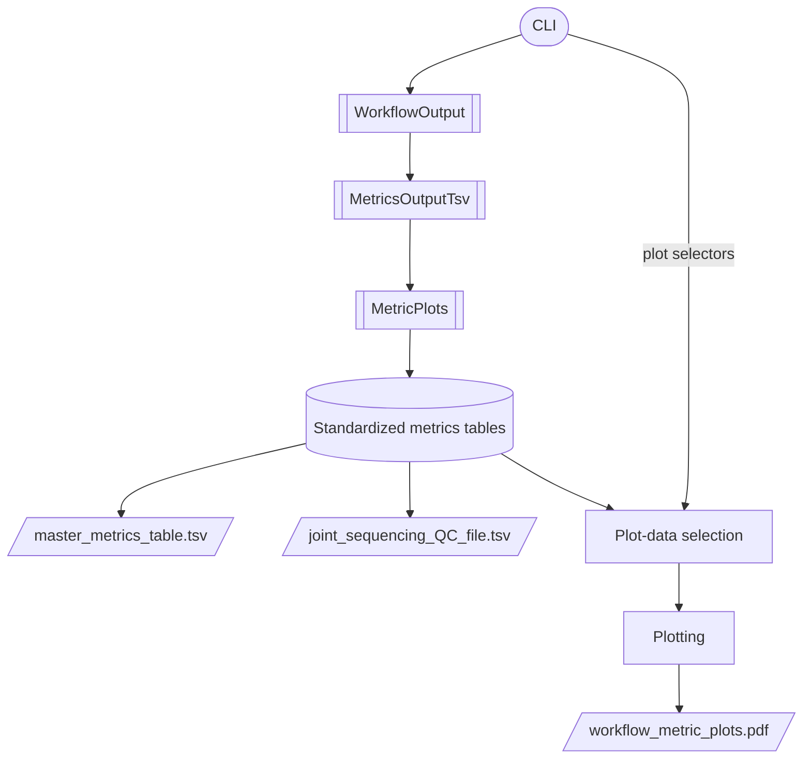

# Metric plots architecture

This document describes the high-level architecture of the `metric_plots` functionality.

For command-line usage, options, and examples, see [`docs/guides/metric_plots.md`](../guides/metric_plots.md).

## Design

The implementation separates workflow discovery, metrics parsing, normalization, and plotting.

**Parse workflow-specific data once, normalize it once, and let downstream consumers operate on the standardized representation.**

Stadium = CLI entry point, subroutine boxes = classes, cylinder = the standardized in-memory tables (`master`/`joint_qc`), parallelogram = files written to disk.

## Components

### `cli.py`

The `metric-plots` command in `cli.py` validates command-line input, creates `MetricPlots`, generates the metrics tables, and optionally requests plotting. Metric transformation logic itself lives in `MetricPlots`, not in `cli.py`.

### `WorkflowOutput`, `MetricsOutputTsv`, `MetricPlots`

Class descriptions are documented in [Functions and classes](./functions_and_classes.md#classes).

`MetricPlots`'s exact run- and plot-selection rules are documented in [Selecting runs](../guides/metric_plots.md#selecting-runs) and [Selecting runs for plotting](../guides/metric_plots.md#selecting-runs-for-plotting) in the user guide.

### Plotting

The plotting layer consumes standardized Polars DataFrames.

Plot definitions live in `PLOT_SPECS` (`plot_specs_workflows.py`), a declarative table listing every plot's title, page index, and data source per workflow. The rendering functions themselves are workflow-agnostic: the same code renders a plot for both DRAGEN and LocalApp, driven entirely by which `PLOT_SPECS` entries apply to the selected workflow.

## Standardized data

Metrics from DRAGEN and LocalApp are normalized into a common schema before plotting.

The master table's exact columns, metric naming convention, and record types are documented in the [metric plots user guide](../guides/metric_plots.md#master_metrics_tabletsv).

Sample type is taken from `Sample_Type` in the workflow sample sheet, which is the authoritative source because it determines how the upstream analysis was performed.

Lower and upper specification limits are represented as threshold records in the standardized data.

## Outputs

The exact output files of the command are documented in [Generated outputs](../guides/metric_plots.md#generated-outputs) in the user guide.

When plotting is requested, `select_plot_data()` returns two in-memory tables — `plot_frame` (selected rows from the master table) and `plot_joint_qc` (matching sequencing-QC rows) — which are passed directly to `Generate_qc_plots()`. Temporary plotting tables are not written to disk.

## Run handling

Runs may be selected explicitly or discovered from the input glob.

Run ordering is resolved before metrics from individual workflow outputs are combined. `RUN_INDEX` records that resolved order.

Detailed run-selection behavior belongs in the user guide: [Selecting runs](../guides/metric_plots.md#selecting-runs), [Run order and `RUN_INDEX`](../guides/metric_plots.md#run-order-and-run_index), and [Selecting runs for plotting](../guides/metric_plots.md#selecting-runs-for-plotting).

## Validation

Validation is performed at the layer responsible for the corresponding input:

- Typer validates command-line values and file options.
- `MetricPlots` validates run selection and normalized data.
- workflow parser classes validate workflow-specific files.

Recoverable conditions are logged while invalid or ambiguous data that would make the output unreliable causes processing to fail.

## Testing

Metric processing, CLI behavior, and plotting are tested independently.

Fixtures should remain small and generic while covering supported workflows and important edge cases.

## Extension

New workflows should be integrated at the workflow/parsing layer and normalized into the existing standardized representation.

New metrics should enter the standardized tables before being consumed by downstream plotting.

New plots should consume standardized plotting data and should not parse raw workflow files or recreate upstream metadata.