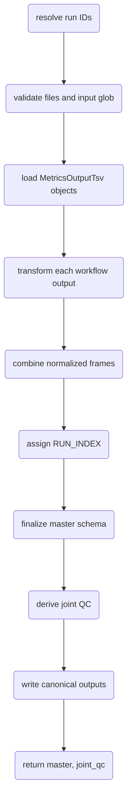
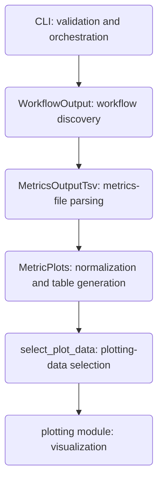

# Metric plots architecture

This document describes the internal design of the `metric_plots` workflow.

For command-line usage and examples, see [`docs/guides/metric_plots.md`](../guides/metric_plots.md).

## Design goals

The implementation separates four concerns:

1. workflow discovery;
2. `MetricsOutput.tsv` parsing;
3. metric normalization and table generation;
4. plotting.

The central rule is:

**Parse workflow-specific data once, normalize it once, and let downstream consumers operate on the standardized representation.**


### CLI

The CLI handles:

- Typer option validation;
- mutually exclusive run selectors;
- workflow selection;
- construction of `MetricPlots`;
- calls to the public API;
- handoff to plotting.

It must not contain metric transformation logic.

### `WorkflowOutput`

`WorkflowOutput` interprets a candidate workflow root using the workflow configuration and nomenclature configuration.

It supplies the workflow-aware context required to locate and identify downstream files.

### `MetricsOutputTsv`

`MetricsOutputTsv` parses one QC metrics file and exposes:

- parsed metric sections;
- workflow type;
- workflow version;
- source path.

It does not combine runs or generate plots.

### `MetricPlots`

`MetricPlots` is the normalization and orchestration layer.

Its public methods are:

```python
generate_metrics_tables()
select_plot_data()
```

`generate_metrics_tables()` creates the standardized master and joint QC tables.

`select_plot_data()` creates the workflow- and run-specific DataFrames consumed by plotting.

### Plotting layer

The plotting layer consumes standardized Polars DataFrames. It should not search workflow directories, parse raw workflow files, infer sample type, or recreate run ordering.

The CLI prepares the plotting DataFrames via `select_plot_data()` and passes them directly to `generate_qc_plots()`.

## Constructor and invariants

`MetricPlots` receives:

```python
config_yaml
inpred_nomenclature
input_glob
run_ids
run_id_file
```

`run_ids` and `run_id_file` are mutually exclusive.

The class enforces this independently of Typer so direct Python callers cannot bypass the contract.

## Run-ID resolution

`_parse_run_id_input()` accepts a comma-separated string or a list of strings.

`_read_run_id_file()`:

- skips blank lines;
- skips comment lines beginning with `#`;
- accepts comma-separated IDs on a line.

Parsed IDs are deduplicated while preserving first occurrence.

The resulting order is retained and later defines `RUN_INDEX`.

## Input validation and discovery

`_validate_inputs()` checks the configuration files and resolves `input_glob`.

Only matching directories are retained in `self.input_roots`.

A requested run is matched by exact basename equality:

```python
root.name == run_id
```

This avoids accidental substring matches.

The same run may have several matching workflow roots. Each candidate is parsed independently. Invalid candidates are logged at `DEBUG` level and skipped.

Processing fails when a requested run has no valid workflow output.

## Generation module

`generate_metrics_tables()` follows this sequence:



The method writes:

- `master_metrics_table.tsv`
- `joint_sequencing_QC_file.tsv`

and returns the same data as Polars DataFrames so plotting can continue without rereading them.

## Section normalization

Each parsed section is processed by `_standardize_section()`.

The method:

- normalizes the first column to `Metric (UOM)`;
- ensures `LSL Guideline` and `USL Guideline` exist;
- casts values to strings where possible;
- converts configured missing-value markers to null;
- strips whitespace;
- normalizes metric labels;
- applies `DNA_` or `RNA_` prefixes based on section type.

Configured missing-value markers include:

```text
""
-
NA
N/A
nan
None
```

Metric-name normalization removes units, replaces `%` with `PCT`, converts non-alphanumeric separators to `_`, and collapses repeated underscores.

## Sample and structural columns

`_sample_columns()` excludes structural fields:

```text
Metric (UOM)
LSL Guideline
USL Guideline
Value
-
<empty>
```

All remaining columns are treated as sample identifiers.

## Wide-frame conversion

`_section_to_wide()` converts selected section columns into a table keyed by `SAMPLE_ID`.

Threshold identifiers are mapped to:

```text
LSL_Guideline
USL_Guideline
```

Run-level `Value` columns are mapped to:

```text
__RUN_VALUE__
```

Before pivoting, duplicate sample/metric pairs are checked. Repeated identical values are allowed, but conflicting values raise an error.

`_merge_wide_frames()` performs the same conflict check while combining section frames.

The implementation therefore fails explicitly instead of silently selecting an ambiguous value.

## Run-level metrics

Sections containing `Value` contribute run-level metrics.

After merging, one logical run-level row is expected per workflow output. More than one row is treated as ambiguous and raises an error.

When sample rows exist, run-level values are cross-joined onto them so later aggregation can retrieve sequencing-wide metrics.

## Record classification

`_add_record_type()` classifies sample rows using the `Sample_Type` column from the sample sheet, which is the authoritative source for whether a sample is DNA or RNA — the analysis itself is run based on the sample sheet, so metric content and `SAMPLE_ID` text are not used for classification.

`SAMPLE_ID` values in the metrics output correspond to `Pair_ID` in the sample sheet, so the lookup joins on `Pair_ID` when that column is present and falls back to `Sample_ID` otherwise.

- `Sample_Type` is `DNA`: `DNA_SAMPLE`
- `Sample_Type` is `RNA`: `RNA_SAMPLE`

Unresolved rows receive:

```text
SAMPLE
```

This includes samples with no matching sample sheet row, a sample sheet with no `Sample_Type` column, and `Pair_ID` values that map to more than one distinct `Sample_Type` (e.g. a DNA/RNA sample pair sharing one `Pair_ID`) — all logged as warnings rather than guessed.

This allows non-InPreD sample IDs to remain usable.

## Threshold records

The synthetic threshold identifiers are converted into:

```text
LOWER_THRESHOLD
UPPER_THRESHOLD
```

Thresholds stay in the normalized table so workflow- and version-specific limits remain attached to their source data.

## Final master schema

After transformation, metadata is added:

```text
RUN
WORKFLOW_TYPE
WORKFLOW_VERSION
```

`_finalize_frame()` orders columns as:

1. metadata;
2. run-level metrics;
3. DNA metrics;
4. RNA metrics.

Metric columns are sorted within their groups.

All finalized values are strings and nulls become `NA`.

## Combining workflows and runs

`_combine_runs()` uses diagonal concatenation.

This allows different workflow types or versions to expose different metric columns. Unavailable values are represented as `NA` in the final schema.

Generation fails if no normalized workflow frames exist.

## `RUN_INDEX`

`_add_run_index()` maps the supplied run order to a zero-padded index.

For three runs:

```text
RUN_A -> 003
RUN_B -> 002
RUN_C -> 001
```

The width is:

```python
max(3, len(str(n_runs)))
```

`RUN_INDEX=001` means the last supplied run. No date parsing is performed.

The index is global across the complete selected run list. Consequently, a workflow-specific subset may not contain `001` when that workflow is unavailable for the last supplied run.

## Joint sequencing QC

`_create_joint_qc()` derives one row per:

```text
RUN_INDEX
RUN
WORKFLOW_TYPE
WORKFLOW_VERSION
```

Only sample records participate; threshold records are excluded.

Current joint metrics are:

```text
PCT_PF_READS
PCT_Q30_R1
PCT_Q30_R2
CLUSTER_DENSITY
ESTIMATED_YIELD
CLUSTERS_PASSING_FILTER
```

The first non-null, non-`NA` value is selected for each group. Missing metrics are added as null and finalized as `NA`.

The output renames `RUN` to `RUN_ID`.

## Plot-data selection

`select_plot_data()` is the boundary between normalization and plotting.

It first filters the master table by `WORKFLOW_TYPE`, then gets available runs with:

```python
unique(maintain_order=True)
```

Selection behavior is:

1. last `N` runs when `plot_last_runs` is provided;
2. explicit runs when `plot_run_ids` is provided;
3. all available workflow runs for direct API use when neither is provided.

Unavailable explicit runs are logged and skipped.

The method returns:

```python
plot_frame, plot_joint_qc
```

No temporary files are required.

## I/O policy

Only reusable canonical outputs are written.

Intermediate plotting frames remain in memory. This avoids unnecessary I/O and allows workflow managers such as Nextflow to control file publication.

Development exports may be produced temporarily for collaboration, but they are not part of the production interface.

## Validation and logging

Validation is placed at the narrowest appropriate layer:

- Typer options: file existence, enum values, integer bounds;
- CLI command: cross-option combinations;
- `MetricPlots`: class invariants and data integrity;
- parser classes: workflow-file structure.

Logging follows:

| Level | Purpose |
|---|---|
| `INFO` | Normal milestones and row/run counts |
| `WARNING` | Recoverable conditions |
| `DEBUG` | Candidate roots that are skipped |
| `ERROR` | Failures followed by exceptions |

Examples of fatal conditions are missing configuration files, unmatched globs, unavailable requested runs, conflicting metric values, invalid run-level rows, and empty transformed output.

## Testing strategy

Metric-processing tests should cover:

- run-ID parsing and deduplication;
- mutual exclusivity;
- input-glob validation;
- exact run-root matching;
- metric-name and missing-value normalization;
- wide conversion and conflict detection;
- run-level metrics;
- metric-first DNA/RNA classification;
- threshold records;
- `RUN_INDEX`;
- joint QC generation;
- workflow filtering;
- last-N and explicit plot selection.

CLI tests should cover user-facing option contracts.

Plotting tests should consume small standardized DataFrames independently of workflow parsing.

Committed fixtures should remain minimal and generic, preferably one small case per workflow with synthetic sample IDs.

## Extension guidelines

### New metric

Expose it through the parser, normalize it into the existing schema, and add it to joint QC or plotting specifications only when required.

### New workflow

Add support at the workflow/parsing layer so `MetricPlots` continues receiving the same section-oriented representation.

### New plot

Consume `plot_frame` and `plot_joint_qc`. Do not parse raw workflow files or recreate upstream metadata.

## Architecture summary



For end-user commands and output descriptions, see [`docs/guides/metric_plots.md`](../guides/metric_plots.md).
